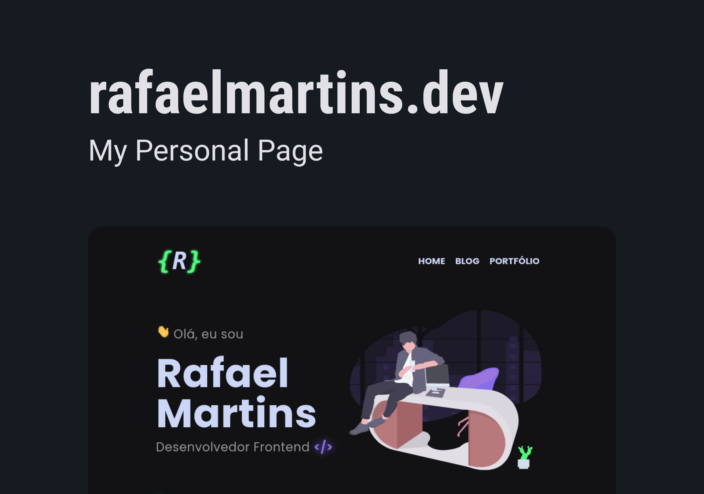

# rafaelmartins.dev

<p>
  
  
  
  <a href="https://opensource.org/licenses/MIT">
    
  </a>
</p>

## Tópicos

[Sobre](#sobre)

[Funcionalidades](#funcionalidades)

[Tecnologias e Ferramentas](#tecnologias-e-ferramentas)

[Instalação e uso](#instalação-e-uso)

[Licença](#licença)

<br>

## Sobre

<p align="center">
  
</p>

Página pessoal com o propósito de servir como blog e portfólio, desenvolvida usando o framework [Next.js](https://nextjs.org/).

<br>

## Funcionalidades

- [X] JAMstack.
- [X] Design simples, limpo e responsivo.
- [X] Páginas dinâmicas geradas com Static Site Generation (SSG).
- [X] Blog integrado.
- [X] Markdown highlighting.
- [X] Scroll to top.
- [X] API gerada com Strapi CMS.
- [X] Animações de transição entre as páginas e de scroll.
- [X] Provedor de imagens by Cloudinary.
- [X] Lazy loading p/ otimizar o desempenho das imagens.
- [X] Integração com o sistema de comentários Disqus.
- [X] SEO otimizado.

<br>

## Tecnologias e Ferramentas

As seguintes tecnologias foram utilizadas no desenvolvimento do projeto:

- [React](https://reactjs.org/)
- [Next.js](https://nextjs.org/)
- [TypeScript](https://www.typescriptlang.org/)
- [Styled Components](https://styled-components.com/)
- [React Icons](https://react-icons.github.io/react-icons/)
- [AOS](https://michalsnik.github.io/aos/)
- [Prism.js](https://prismjs.com/)
- [remark](https://remark.js.org/)
- [disqus-react](https://www.npmjs.com/package/disqus-react)
- [Strapi CMS](https://strapi.io/)
- [Vercel](https://vercel.com/dashboard)
- [Heroku](https://www.heroku.com/)
- [Cloudinary](https://cloudinary.com/)
- [VS Code](https://code.visualstudio.com/) com [ESLint](https://eslint.org/), [Prettier](https://prettier.io/) e [EditorConfig](https://editorconfig.org/)

<br>

## Instalação e Uso

Instale as dependências e rode o development server:

```bash
yarn install

yarn dev
```

Abra [http://localhost:3000](http://localhost:3000) em seu navegador para ver o resultado.

<br>

## Deploy on Vercel

[Click aqui](https://rafaelmartins.dev/) para ver a live preview deste projeto.

<br>

## Licença

<a href="https://opensource.org/licenses/MIT">
  
</a>

<br>

Esse projeto está sob a licença MIT. Veja o arquivo [LICENSE](/LICENSE) para mais detalhes.

---

Made with :purple_heart: by [Rafael Martins](https://github.com/martins-rafael)

[](https://www.linkedin.com/in/rafaeldcmartins/)
[](mailto:rafaeldcmartins@gmail.com)
