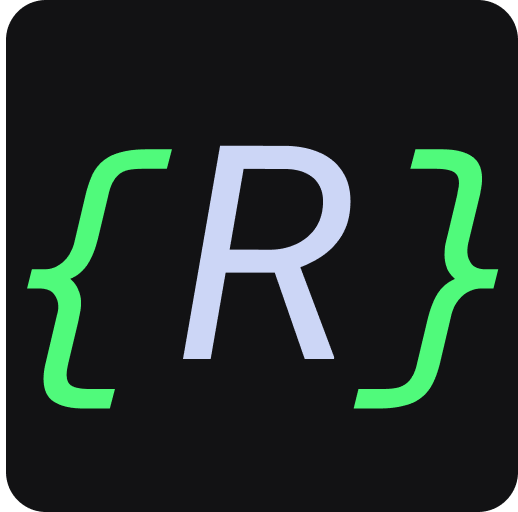

<table align="right">
  <tr>
    <td>
      <a href="README_EN.md">English</a>
    </td>
  </tr>
  <tr>
    <td>
      <a href="README.md">Português</a>
    </td>
  </tr>
</table>

<br>
<br>

# rafaelmartins.dev

<p>
  
  
  
  <a href="https://opensource.org/licenses/MIT">
    
  </a>
</p>



## Table of Contents

[About](#about)

[Features](#features)

[Techs and Tools](#techs-and-tools)

[Getting Started](#getting-started)

[LICENSE](#license)

<br>

## About

<p align="center">
  
</p>

Personal page with the purpose of serving as a portfolio. The project was developed using JAMStack (JavaScript, API, Markup), using technologies like Next.js and TypeScript to build the interface, consuming an API made with Strapi CMS and generating dynamic pages with the Next.js static generator (SSG).

<br>

## Features

- [X] JAMstack.
- [X] Simple, clean and responsive design.
- [X] Dynamic pages generated with Static Site Generation (SSG).
- [X] Integrated blog.
- [X] Markdown highlighting.
- [X] Scroll to top.
- [X] Custom API made with Strapi Headless CMS..
- [X] Transition animations between pages and scroll animations.
- [X] Microinteractions.
- [X] Image Provider by Cloudinary.
- [X] Lazy loading to optimize image performance.
- [X] SEO optimized.

<br>

## Techs and Tools

The following technologies were used in the development of the project:

- [React](https://reactjs.org/)
- [Next.js](https://nextjs.org/)
- [TypeScript](https://www.typescriptlang.org/)
- [Styled Components](https://styled-components.com/)
- [React Icons](https://react-icons.github.io/react-icons/)
- [AOS](https://michalsnik.github.io/aos/)
- [Prism.js](https://prismjs.com/)
- [remark](https://remark.js.org/)
- [NProgress](https://github.com/apal21/nextjs-progressbar)
- [Strapi CMS](https://strapi.io/)
- [Vercel](https://vercel.com/dashboard)
- [Heroku](https://www.heroku.com/)
- [Cloudinary](https://cloudinary.com/)
- [VS Code](https://code.visualstudio.com/) with [ESLint](https://eslint.org/), [Prettier](https://prettier.io/) and [EditorConfig](https://editorconfig.org/)

<br>

## Getting Started

Install the dependencies and run the development server:

```bash
yarn install

yarn dev
```

Open [http://localhost:3000](http://localhost:3000) in your browser to see the result.

<br>

## Deploy on Vercel

[Click here](https://rafaelmartins.dev/) to see the live preview of this project.

<br>

## LICENSE

<a href="https://opensource.org/licenses/MIT">
  
</a>

<br>

This project is under the MIT license. See the [LICENSE](/LICENSE) file for more details.

---

Made with :purple_heart: by [Rafael Martins](https://github.com/martins-rafael)

[](https://www.linkedin.com/in/rafaeldcmartins/)
[](mailto:rafaeldcmartins@gmail.com)
